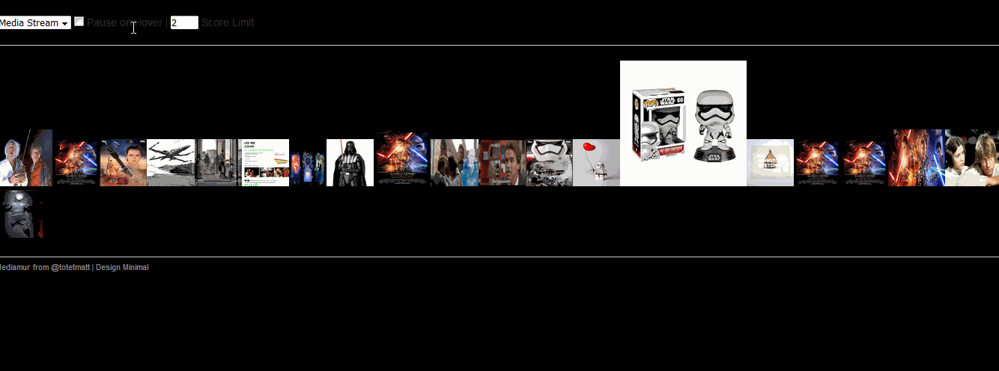

# Mediamur
Server & Simple Html Client to display media from a Twitter Stream.

# How to ?
## Configuration
### application.properties
| Property                       | Type    | Comment        |
|------------------------------ | ------- | --------------- |
| twitter.OAuthConsumerKey      | String  |Your Consumer Key|
| twitter.OAuthConsumerSecret   | String  |Your Consumer Secret |
| twitter.OAuthAccessToken      | String  |Your Access Token |
| twitter.OAuthAccessTokenSecret| String  | Your Access Token Secret |
| mediamur.pauseOnHover         | Boolean | When cursor is on picture, stop the scrolling of incoming images (can be changed on UI after) |
| mediamur.imageScoreLimit      | Integer | Minimum image score before displayed (can be changed on UI after)|
| mediamur.saveImage            | Boolean | Save the image in the filesystem |
| mediamur.saveDirectory        | String  | Path to store the images if saveImage is enabled |

### streamquery.yml
```
words:
    - words1
users:
    - {"screenName":aUser}
locations:
    - {"southWestLat":40.756761 ,"southWestLong":-73.989996 ,"northEastLat":40.762039,"northEastLong":-73.971516} 
sampleStream: {useSampleStream: false}
```

## Working in local
### Run the Server
Grab the Mediamur jar at [https://github.com/totetmatt/mediamur/releases](https://github.com/totetmatt/mediamur/releases "https://github.com/totetmatt/mediamur/releases").

Launch it with the command `java -jar mediamur.jar`

The in-the-box configuration doesn't have stream filter and will use the sample stream api from twitter. Modify the **streamquery.yml** to have a filtered stream with custom search.

### Run the Client
Open your web browser and go to `http://localhost:8080/`.

##Working in remote
If you need that other people access to your stream, you'll need to makes some changes.

*There will be some advise given, but please adapt the solution to your problem.*
###Run the Server
Nothing to change execpt that the entrypoint will be `http://<yourHostName>:8080/mediastream`.

You should make sure also that the `http://<yourHostName>:8080/mediastream` is accessible from where the other users will be (internet, local network etc..)

### Run the Client
The application serves automatically the web page at `http://<yourHostName>:8080/`

#Dockerized version
Soon